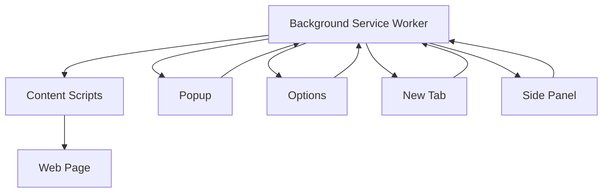

# System Patterns

## Architecture Overview
The extension follows a modular architecture with clear separation of concerns:

1. **Entry Points**
   - Background service worker
   - Content scripts
   - DevTools integration
   - New tab page
   - Options page
   - Popup window
   - Side panel
   - Custom pages

2. **Core Components**
   - Authentication system
   - Storage management
   - Message passing
   - UI components
   - State management
   - Internationalization
   - Analytics

## Design Patterns
1. **Service Worker Pattern**
   - Background script as service worker
   - Event-driven architecture
   - Message passing between components

2. **Component Architecture**
   - React functional components
   - Hooks for state management
   - Custom hooks for extension-specific logic

3. **Message Passing**
   - Type-safe message interfaces
   - Centralized message handling
   - Cross-component communication

4. **Storage Management**
   - Type-safe storage interfaces
   - Encrypted storage for sensitive data
   - Synchronized storage across components

## Component Relationships

## Key Technical Decisions
1. **Framework Choice**
   - WXT for extension development
   - React for UI components
   - TypeScript for type safety

2. **Build System**
   - Bun as package manager
   - Vite for development
   - Custom build configuration

3. **UI Framework**
   - shadcn/ui for components
   - Tailwind for styling
   - Custom theme support

4. **Development Tools**
   - Biome for linting
   - Husky for git hooks
   - GitHub Actions for CI/CD 