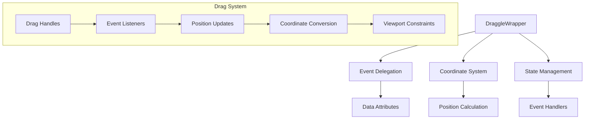
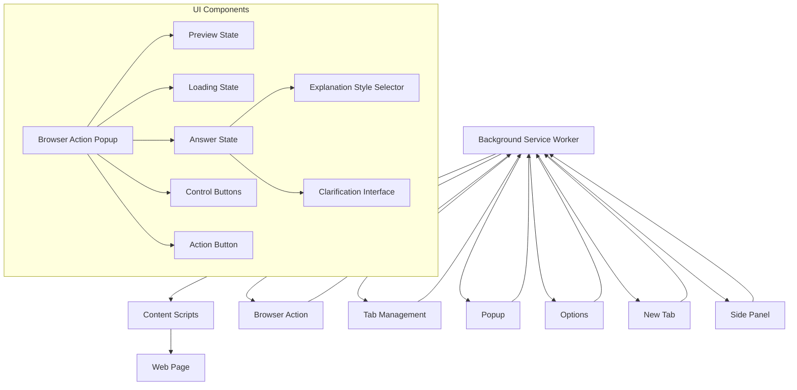

# System Patterns

## Architecture Overview
The extension follows a modular architecture with clear separation of concerns:

1. **Entry Points**
   - Background service worker
   - Browser action
   - Content scripts
   - DevTools integration
   - New tab page
   - Options page
   - Popup window
   - Side panel
   - Custom pages

2. **Core Components**
   - Browser action handler
   - Tab management
   - Authentication system
   - Storage management
   - Message passing
   - UI components
   - State management
   - Internationalization
   - Analytics
   - Coordinate system
   - Drag and drop system

3. **UI Components**
   - Browser action popup
   - Floating button
   - Multi-state popup
   - Action button
   - Content display
   - Control buttons
   - DraggleWrapper
   - Loading states
   - Preview states
   - Coordinate converters
   - Drag handles

## Design Patterns

1. **Drag and Drop System**
   - Event delegation using data attributes
   - Percentage-based positioning
   - Coordinate conversion utilities
   - Axis-specific locking
   - Cursor state management
   - Text selection control
   - Event listener optimization
   - useRef for stable references
   - Viewport boundary handling

2. **Component Architecture**
   - React functional components
   - Hooks for state management
   - Custom hooks for extension-specific logic
   - Forward refs for DOM manipulation
   - Callback memoization for performance
   - Component composition
   - State machine pattern for UI states
   - Controlled form components
   - Event delegation patterns

3. **Message Passing**
   - Type-safe message interfaces
   - Centralized message handling
   - Cross-component communication
   - Event handler reference management
   - Stable event listeners
   - Memory leak prevention
   - Event cleanup patterns

4. **Coordinate System**
   - Pixel to percentage conversion
   - Viewport-relative positioning
   - Boundary constraints
   - Responsive positioning
   - Screen size adaptation
   - Position calculation utilities
   - Coordinate type definitions

5. **UI Interaction Patterns**
   - Data attribute-based event delegation
   - Selective text selection
   - Dynamic cursor styles
   - Drag handle identification
   - Smooth animations
   - Position constraints
   - Axis locking
   - Event bubbling control

6. **State Management**
   - Component-level state
   - Drag operation state
   - Position state
   - Cursor state
   - Selection state
   - Reference management
   - Event handler state
   - Cleanup patterns

## Component Relationships

## Key Technical Decisions

1. **Drag and Drop Implementation**
   - Event delegation with data-draggle-wrapper
   - Percentage-based positioning
   - Coordinate conversion utilities
   - Axis locking support
   - Cursor state management
   - Text selection control
   - Event listener optimization

2. **Component Design**
   - Forward refs for DOM access
   - Callback memoization
   - State isolation
   - Event delegation
   - Position management
   - Style separation
   - Accessibility support

3. **Event Management**
   - Stable handler references
   - Cleanup optimization
   - Memory leak prevention
   - Event delegation
   - Bubbling control
   - State preservation

4. **Position System**
   - Viewport percentage calculation
   - Boundary enforcement
   - Coordinate conversion
   - Responsive adaptation
   - Position utilities
   - Type definitions

5. **User Interaction**
   - Selective text selection
   - Dynamic cursors
   - Drag handles
   - Smooth transitions
   - Position constraints
   - Accessibility
   - Touch support

## Design Patterns
1. **Service Worker Pattern**
   - Background script as service worker
   - Event-driven architecture
   - Message passing between components
   - Browser action event handling
   - Tab management

2. **Component Architecture**
   - React functional components
   - Hooks for state management
   - Custom hooks for extension-specific logic
   - Forward refs for DOM manipulation
   - Callback memoization for performance
   - Component composition
   - State machine pattern for UI states
   - Controlled form components

3. **Message Passing**
   - Type-safe message interfaces
   - Centralized message handling
   - Cross-component communication
   - Browser action event propagation
   - Tab event handling
   - Content script messaging

4. **Storage Management**
   - Type-safe storage interfaces
   - Encrypted storage for sensitive data
   - Synchronized storage across components
   - Local storage for user preferences
   - Storage change listeners
   - Default value fallbacks

5. **UI Interaction Patterns**
   - Browser action click handling
   - Tab creation and management
   - Fixed positioning for floating elements
   - Smooth drag and drop operations
   - Viewport-aware positioning
   - Dedicated drag handles
   - Responsive layout adjustments
   - State-based transitions
   - Smooth animations
   - Dropdown menu interactions

6. **State Management**
   - Enum-based state machine
   - State transition handlers
   - Loading state management
   - Preview state handling
   - Error state handling
   - Browser action state management
   - Tab state management
   - User preference state

7. **Explanation System**
   - Four-tier explanation styles (child, student, beginner, analogy)
   - Real-life analogies for technical concepts
   - Context-aware explanations
   - Language-specific translations
   - Dynamic style switching
   - Consistent terminology across styles
   - User-friendly interface for style selection
   - Clear visual feedback for selected style
   - Seamless integration with popup UI
   - Type-safe style definitions with enums
   - Efficient message passing for style changes
   - Optimized prompt generation
   - Context preservation across styles
   - Persistent style storage using local storage
   - In-memory style caching for performance
   - Style state preservation across clarification questions
   - Default style fallback mechanism
   - Type-safe storage key definitions
   - Style-specific prompt templates
   - Style persistence across sessions

## Component Relationships

## Key Technical Decisions
1. **Framework Choice**
   - WXT for extension development
   - React for UI components
   - TypeScript for type safety

2. **Build System**
   - Bun as package manager
   - Vite for development
   - Custom build configuration

3. **UI Framework**
   - shadcn/ui for components
   - Tailwind for styling
   - Custom theme support
   - Fixed positioning strategy
   - Drag and drop implementation
   - Animation system
   - Dropdown menus for user selections

4. **Development Tools**
   - Biome for linting
   - Husky for git hooks
   - GitHub Actions for CI/CD

5. **Interaction Patterns**
   - Browser action click handling
   - Tab creation and management
   - Mouse event-based drag operations
   - Position-based offset calculations
   - Viewport boundary constraints
   - Smooth movement transitions
   - State-based animations
   - Component composition
   - Dropdown selection for explanation styles

6. **State Management**
   - Enum-based state machine
   - React hooks for state
   - Event-driven state transitions
   - Loading state handling
   - Error state management
   - Tab state management
   - User preference state management

7. **Storage Strategy**
   - Local storage for user preferences
   - Chrome storage API for persistence
   - Type-safe storage keys
   - Storage change listeners
   - Default value fallbacks
   - Session-based caching

8. **Explanation System Design**
   - Style-based prompt templates
   - Context-aware explanations
   - User-selectable explanation styles
   - Four distinct explanation modes
   - Persistent style preferences
   - Optimized message handling
   - Translation support for all styles
   - Real-life analogies for technical concepts
   - Multi-level explanation complexity 